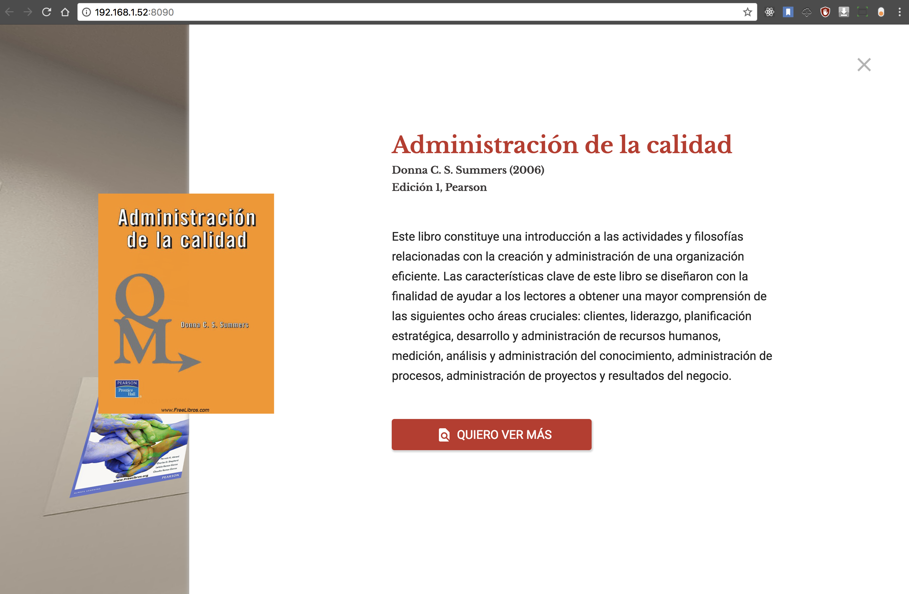
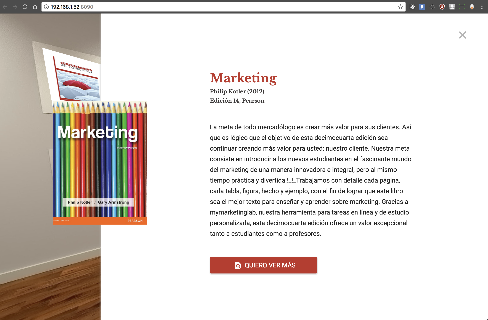

# Biblioteca360

Inmersive 360 galery book using javascript and krpano library

# Mockup scketch!

# Make it work!

1. Clone the project

2. Download Krpano from https://krpano.com/download/ and install it!

3. Open KrPano and run KrPano Testing Server application

4. On server setup tab, set the local cloned project root in the Local Folder input ('.../biblioteca360')

5. Click on the generated local url in Server Adress label

6. Enjoy it!

